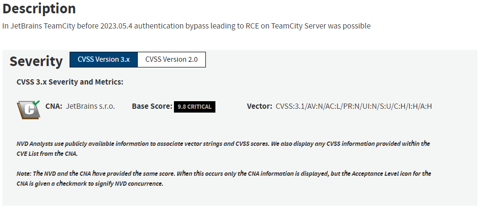
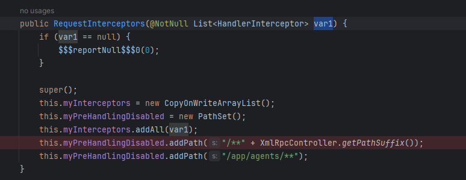
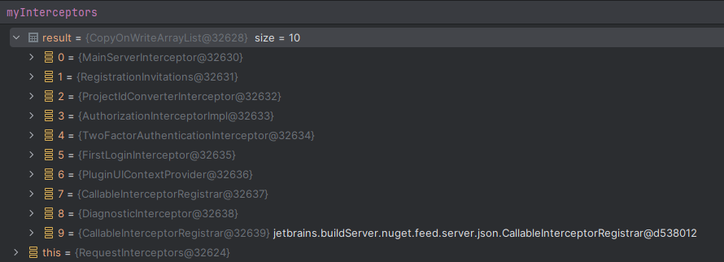
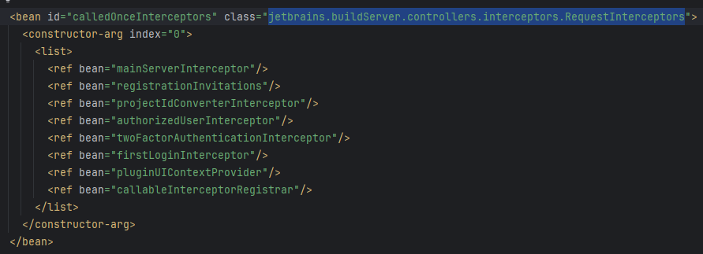
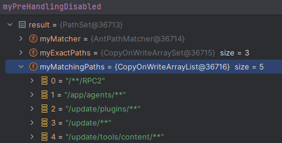

# Giới thiệu
TeamCity là một máy chủ tích hợp liên tục và phân phối công cụ quản lý “build”. Nó tự động hoá các quy trình thông thường, sắp xếp hợp lý quá trình phát triển, cải thiện giao tiếp nhóm. TeamCity cải thiện khả năng giao tiếp của nhóm, giúp các nhóm phát triển triển khai dự án tốt nhất.
# CVE-2023-42793
CVE-2023-42793 là lỗ hổng cho phép kẻ tấn công bypass authentication và lấy được quyền admin. Từ đó có thể RCE được hệ thống.

## Set Up
Mình sử dụng docker và debug ở cổng 5005
```
docker run -dt -p 8111:8111 -p 5005:5005 -e TEAMCITY_SERVER_OPTS=-agentlib:jdwp=transport=dt_socket,server=y,suspend=n,address=*:5005 jetbrains/teamcity-server:2023.05.3
```
## Diff
Sau khi diff 2 bản mình nhận thấy đường dẫn wildcard đã bị loại bỏ trong `jetbrains.buildServer.controllers.interceptors.RequestInterceptors`.

## Authentication Bypass
Đặt debug tại `jetbrains.buildServer.controllers.interceptors.RequestInterceptors#RequestInterceptors` và chạy PoC mình xác nhận được `XmlRpcController.getPathSuffix())` có giá trị là `/RPC2`(nguyên nhân dẫn đến lỗi này)  
  
  
Trong quá trình khởi tạo `RequestInterceptors`, `authorizedUserInterceptor` được thêm vào `myInterceptors`. `authorizedUserInterceptor` sẽ thực thi kiểm tra xác thực của request.  
   
Sau đó, khi phân tích file `webapps\ROOT\WEB-INF\buildServerSpringWeb.xml` mình nhận thấy `calledOnceInterceptors` là 1 instance của class `jetbrains.buildServer.controllers.interceptors.RequestInterceptors`.  
   
`RequestInterceptors` sẽ chặn các HTTP requests thông qua hàm `jetbrains.buildServer.controllers.interceptors.RequestInterceptors#preHandle`

<!--  -->
```
    public final boolean preHandle(final HttpServletRequest httpServletRequest, final HttpServletResponse httpServletResponse, final Object o) throws Exception {
        try {
            if (!this.requestPreHandlingAllowed(httpServletRequest)) {
                return true;
            }
        }
        catch (final Exception ex) {
            throw ex;
        }
        final Stack requestIn = this.requestIn(httpServletRequest);
        Label_0134: {
            try {
                if (requestIn.size() < 70 || httpServletRequest.getAttribute("__tc_requestStack_overflow") != null) {
                    break Label_0134;
                }
            }
            catch (final Exception ex2) {
                throw ex2;
            }
            RequestInterceptors.LOG.warn("Possible infinite recursion of page includes. Request: " + WebUtil.getRequestDump(httpServletRequest));
            httpServletRequest.setAttribute("__tc_requestStack_overflow", (Object)this);
            httpServletRequest.setAttribute("javax.servlet.jsp.jspException", (Object)new ServletException("Too much recurrent forward or include operations").fillInStackTrace());
            final RequestDispatcher requestDispatcher = httpServletRequest.getRequestDispatcher("/runtimeError.jsp");
            try {
                if (requestDispatcher != null) {
                    requestDispatcher.include((ServletRequest)httpServletRequest, (ServletResponse)httpServletResponse);
                }
            }
            catch (final Exception ex3) {
                throw ex3;
            }
            return false;
        }
        if (requestIn.size() == 1) {
            for (final HandlerInterceptor handlerInterceptor : this.myInterceptors) {
                try {
                    if (!handlerInterceptor.preHandle(httpServletRequest, httpServletResponse, o)) {
                        return false;
                    }
                    continue;
                }
                catch (final Exception ex4) {
                    throw ex4;
                }
            }
        }
        return true;
    }
```
Nếu `requestPreHandlingAllowed` return false thì hàm `preHandle` sẽ return sớm, `requestPreHandlingAllowed` return true thì list `myInterceptors` sẽ được lặp lại cho từng request, bao gồm cả `authorizedUserInterceptor` sẽ kiểm tra xác thực của request.  
Do đó nếu ta gửi được 1 request để `requestPreHandlingAllowed` return false thì ta sẽ bypass được xác thực. Sau khi kiểm tra hàm `requestPreHandlingAllowed`, mình nhận ra PathSet `myPreHandlingDisabled` chứa wildcard path /**/RPC2 do đã được thêm từ quá trình khởi tạo bên trên(`this.myPreHandlingDisabled.addPath("/**" + XmlRpcController.getPathSuffix());`) --> `requestPreHandlingAllowed` return false. Từ đó có thể bypass được xác thực
```
    private boolean requestPreHandlingAllowed(@NotNull final HttpServletRequest httpServletRequest) {
        try {
            if (httpServletRequest == null) {
                $$$reportNull$$$0(5);
            }
        }
        catch (final IllegalArgumentException ex) {
            throw ex;
        }
        try {
            if (WebUtil.isJspPrecompilationRequest(httpServletRequest)) {
                return false;
            }
        }
        catch (final IllegalArgumentException ex2) {
            throw ex2;
        }
        try {
            if (!this.myPreHandlingDisabled.matches(WebUtil.getPathWithoutContext(httpServletRequest))) {
                return true;
            }
        }
        catch (final IllegalArgumentException ex3) {
            throw ex3;
        }
        return false;
    }
```


## Exploitation
Theo như những phân tích trên để các API có thể bypass được xác thực thì các endpoint đó phải cho phép tùy chỉnh hậu tố. Đầu tiên hãy cùng phân tích endpoint đã biết là `/app/rest/users/id:1/tokens/RPC2`. Endpoint này được khai báo tại `jetbrains.buildServer.server.rest.request.UserRequest#createToken`
```
    @POST
    @Path("/{userLocator}/tokens/{name}")
    @Produces({"application/xml", "application/json"})
    @ApiOperation(value = "Create a new authentication token for the matching user.", nickname = "addUserToken", hidden = true)
    public Token createToken(@ApiParam(format = "UserLocator") @PathParam("userLocator") String userLocator, @PathParam("name") @NotNull String name, @QueryParam("fields") String fields) {
        if (name == null) {
            $$$reportNull$$$0(1);
        }

        TokenAuthenticationModel tokenAuthenticationModel = (TokenAuthenticationModel)this.myBeanContext.getSingletonService(TokenAuthenticationModel.class);
        SUser user = this.myUserFinder.getItem(userLocator, true);

        try {
            AuthenticationToken token = tokenAuthenticationModel.createToken(user.getId(), name, new Date(PermanentTokenConstants.NO_EXPIRE.getTime()));
            return new Token(token, token.getValue(), new Fields(fields), this.myBeanContext);
        } catch (AuthenticationTokenStorage.CreationException var7) {
            throw new BadRequestException(var7.getMessage());
        }
    }
```
Endpoint này cho phép tạo token thông qua parameter `name` do đó kẻ tấn công có thể tạo được authentication token cho bất kỳ user nào. TeamCity cho phép chúng ta có thể cung cấp administrator user `userLocator` thông qua id của user. Do đó chúng ta có thể sử dụng id user đầu tiên là id:1 và tạo được token của admin.  
POC:
  
  
# THAM KHẢO  
https://attackerkb.com/topics/1XEEEkGHzt/cve-2023-42793/rapid7-analysis?referrer=etrblog  
https://github.com/H454NSec/CVE-2023-42793  